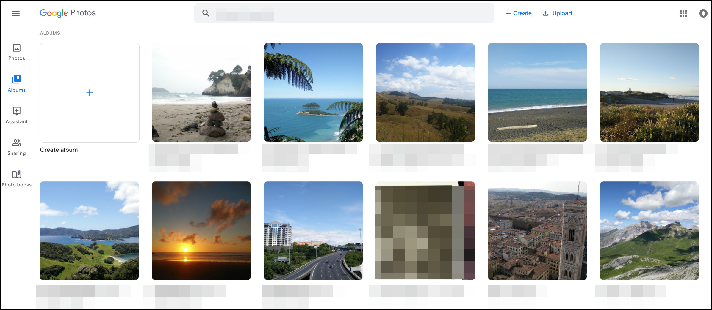

# Hide Albums on Google Photos that are created and populated by Google

## What does this Chrome Extension do?

It removes unwanted clutter albums that are automatically generated by Google.

### Before:

The albums in this picture named _Places_, _Things_, _Videos_, _Collages_, _Animations_ and _Movies_ are automatically generated. I don't use them and I therefor don't want to see them.

### After:

Those albums are now hidden. They still exist but they are not shown while this extension is active.

## Install instructions

Download this repository.

Either by using `git clone https://github.com/realestninja/hidePrepopulatedGPAlbums.git`
or by downloading the zip file in your browser and then unpacking the zip.

After having this folder on your local computer, load the extension in Chrome. To do that, open the extensions tab in Chrome, click "load unpacked" and select the downloaded folder.

